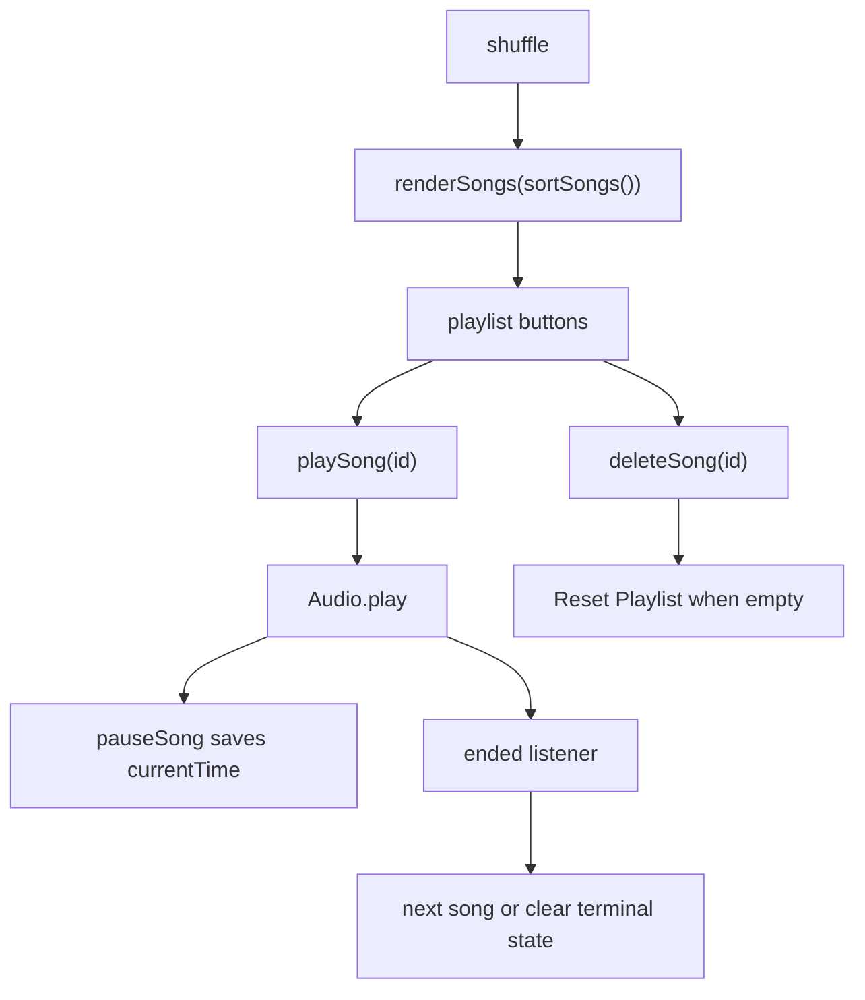

# Music Player

`Music-Player/index.html` provides the player controls, playlist container, current title/artist fields, and stylesheet links. `styles.css` supplies responsive card/control layout and external Google Fonts. `script.js` owns ten `allSongs` records with stable IDs and remote CDN MP3 `src` URLs, creates an `Audio`, and stores `{songs,currentSong,songCurrentTime}` in `userData`.

The diagram shows the source-level runtime flow. `playSong` looks up an ID, sets `audio.src/title`, restores saved time only when the same song is resumed, updates highlighting/display/accessible label, and starts playback. Pause saves `audio.currentTime`. Next and previous use the current index; source code assumes a neighbor exists, so boundary clicks can produce an undefined-song failure. Shuffle mutates order, clears current state, pauses, and rerenders. Delete clears active playback state when needed, rerenders, and when no songs remain creates a reset button that restores `allSongs` and alphabetical sorting. The ended handler advances if possible, otherwise clears current state and accessibility highlight.

`renderSongs` creates inline `playSong(id)` and `deleteSong(id)` handlers and `aria-current` highlighting. `setPlayButtonAccessibleText` labels play with the current or first title. The remote CDN and audio promise/network failures have no explicit error UI. The song IDs, `userData` fields, control IDs, playlist classes, and render helpers are the change surface.

Validate initial sorted playlist, play/pause/resume, next/previous boundaries, shuffle, delete current/non-current songs, empty reset, natural end, accessibility attributes, and offline/CDN failure behavior. There are no automated tests or build scripts.
