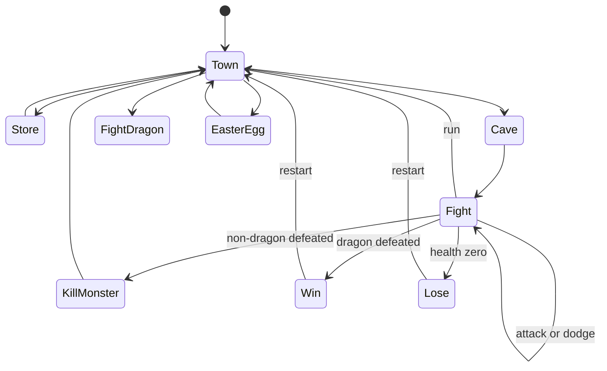

# Role Play Game

`RolePlayGame/index.html` and `styles.css` define the three reusable buttons, narrative text, player stats, and hidden monster panel. The README allows direct browser opening and recommends a local server such as `python -m http.server` for reliable serving. `script.js` keeps mutable `xp`, `health`, `gold`, `currentWeapon`, `fighting`, `monsterHealth`, and `inventory`; the `locations` table is the state-machine registration surface.

The diagram reflects `locations` and handler references. `update(location)` rewires all three button `onclick`s, changes labels/text, and hides monster stats; `goFight` then restores the monster panel and target health. Combat subtracts level-based damage from the player, conditionally damages the monster, rewards XP/gold on defeat, and can randomly break an inventory weapon. The economy prevents purchases without gold and selling the only weapon, but `currentWeapon`, inventory order, and weapon breakage must remain coupled. `restart` resets primary player fields and returns to town, while stale `fighting`/`monsterHealth` variables are not explicitly cleared until the next fight; navigation can therefore expose stale internal state even though the monster panel is hidden. A dragon win goes directly to win; ordinary defeat goes to the reward screen; health-zero and monster-zero checks occur in the same attack call, so changes must preserve terminal ordering.

The easter egg generates ten random integers 0–10: matching 2/8 grants 20 gold, otherwise health loses 10 and zero health calls `lose`. The main change surface is the location table plus its named handlers and stat DOM IDs.

Validate every navigation edge, insufficient funds, weapon purchase/sell/break, each monster, repeated attacks and dodge, death/win/restart, and both easter-egg outcomes. There are no automated tests or build scripts.
