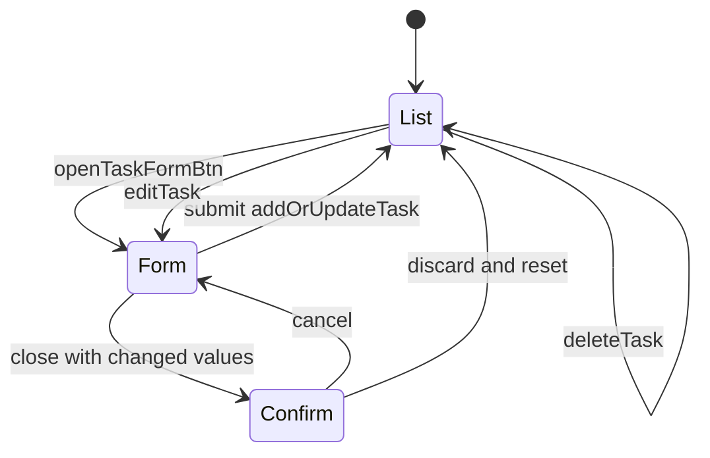

# Todo App

`Todo-App/index.html` defines the hidden task form, title/date/description controls, task list, and native `dialog` confirmation. `styles.css` supplies the responsive form/card styling. `script.js` loads `JSON.parse(localStorage.getItem("data")) || []` into `taskData`; there is no server or external dependency.

The task record is `{id,title,date,description}`. `removeSpecialChars` trims and removes characters outside ASCII letters, digits, hyphens, and spaces from title/description; date is accepted as the browser date input value without additional validation. A blank trimmed title alerts and aborts. New records use a sanitized lowercase title plus `Date.now()`, are unshifted, persisted under key `data`, rendered, and reset. Updates locate by the old ID but construct a new timestamped ID, so editing changes identity and the rendered parent ID. `updateTaskContainer` interpolates all fields into `innerHTML` and attaches inline `editTask(this)`/`deleteTask(this)` handlers; current sanitization reduces (but does not replace a deliberate security review of) HTML injection risk, and date values are displayed exactly as stored.

`editTask` fills the form and changes the submit label. Closing a dirty new or edited form calls `showModal`; cancel closes the dialog and preserves fields, while discard closes and `reset`s. Reset toggles form visibility, clears fields, restores the Add Task label, and clears `currentTask`. Deletion removes the card, splices the matching record, and persists. The source file contains a second complete copy beginning at the repeated `const taskForm` after the first submit listener; executing this script as-is causes a top-level redeclaration syntax failure in browsers, preventing all behavior. Remove or reconcile the duplicate before relying on runtime validation.

Validate fresh storage, add/order/persistence, special-character sanitization, date values, edit identity, delete, dirty close/cancel/discard, reload persistence, and the duplicate-script failure. There are no automated tests or build scripts.
